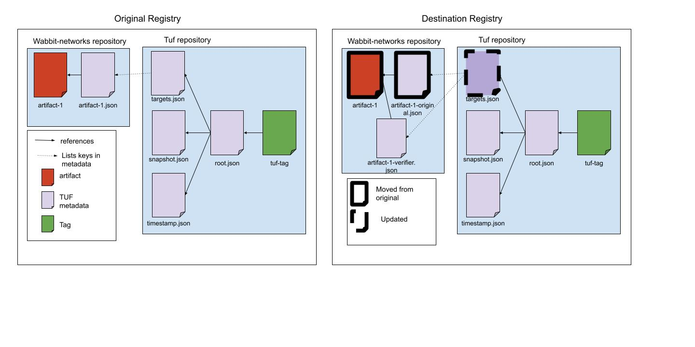

# How to move an artifact signed by tuf-notary

There are a few scenarios for moving artifacts covered in this document:
1. *Mirroring the artifact and TUF metadata* The user wants to mirror an entire registry, including signatures.
2. *Copying the image without no references* The user wants to promote an artifact from another registry, but does not want to copy any signatures. This method will also be used when copying from a registry that doesn't use TUF or signatures.
3. *Copying the image and the original signature(s) from the source registry* The user wants to copy the artifact, as well as one or more signatures into the destination registry. These signatures can be used to associate the image with the original uploader or to maintain a record of attestations of previous steps in the supply chain (build, etc).
4. *Copying the image, original signature(s), and adding an additional verifier's signature* The user wants to copy the artifact and one or more signatures, as well as adding an additional attestation to the artifact. This additional attestation can indicate that certain verification has been done, or that the copy was done by the correct entity.

In all but the first scenario we assume that the destination registry already has a top-level TUF repository set up.

All of these steps for each scenario can be combined into a single CLI/API call with flags indicating whether the original signature is copied, and if a new signature is to be added.
These scenarios are broken out here for clarity about what will happen with the underlying metadata.

## 1. Mirroring the artifact and TUF metadata

Copy the artifact, signature, and all top-level TUF metadata to the new registry.
The mirror will want to ensure that copies are frequent enough that the timestamp and snapshot metadata remain valid.
So, if the timestamp metadata on the source registry expires every hour, the destination registry will want to ensure it is copied at least every hour.
Artifacts and signatures will likely expire less frequently, so a mirror may optimize by only copying artifacts and metadata that have changed.

## 2. Copying the image without no references

1. Copy the artifact to the target repository on the destination registry.
1. Add a TUF signature to the artifact from the verifier or other entity and update the top-level targets metadata accordingly. This will follow the standard signature workflow.
1. (Automated) Update the snapshot and timestamp metadata on the destination registry.

## 3. Copying the image and the original signature(s)

1. Copy the artifact and any delegated targets metadata (signatures) that you wish to copy to the target repository on the destination registry.
1. Update the top-level targets metadata on the destination repository to indicate that the original uploaders' signature(s) should be trusted. To do so, add delegations to all public keys associated with signatures that have been copied. This explicitly states which signatures should be associated with the copied artifact.
1. (Automated) Update the snapshot and timestamp metadata on the destination registry.

## 4. Copying the image, original signature(s), and adding an additional verifier's signature

1. Copy the artifact and any delegated targets metadata to the target repository on the destination registry.
1. Update the top-level targets metadata on the destination repository to indicate that the original uploaders' signature(s) should be trusted, as in the previous scenario.
1. Add a signature to the artifact from the verifier or other entity and update the top-level targets metadata accordingly. This will follow the standard signature workflow.
1. (Automated) Update the snapshot and timestamp metadata on the destination registry.
